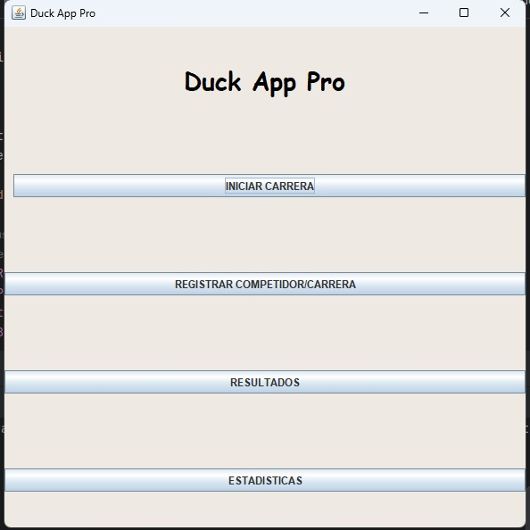
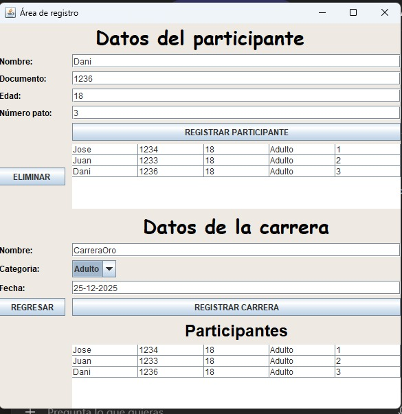
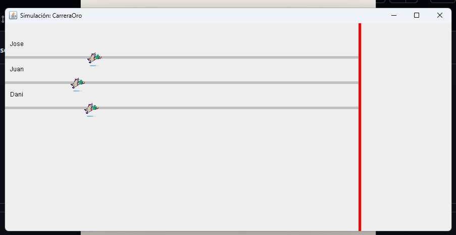

Jose David Jaramillo Rebellon - 202459558
Duck App Pro

Duck App Pro es una aplicación desarrollada en Java con el diseñador de interfaces de Itellij que simula carreras de patos mediante una interfaz gráfica.
El proyecto permite registrar participantes y carreras, simular competencias con animación, almacenar resultados y generar estadísticas básicas.

Este proyecto fue desarrollado como trabajo individual para la asignatura Programación Orientada a Eventos.

---
Pasos de ejecución

1. Clonar o descargar el repositorio.
2. Abrir el proyecto en IntelliJ IDEA (o cualquier IDE compatible con Java).
3. Asegurarse de tener Java JDK 8 o superior.
4. Ejecutar la clase MenuPrincipal. 
5. Registrar participantes y carreras. 
6. Iniciar la simulación de carreras desde el menú. 
7. Visualizar podio, estadísticas y exportar resultados.

---

1. Tecnologías utilizadas

- Java
- Swing (Interfaz gráfica de usuario)
- Serialización de objetos (`.dat`) para persistencia
- Archivos de texto (.txt) para exportación de resultados
- Arquitectura MVC (Modelo – Vista – Controlador)

2. Arquitectura del proyecto (MVC)

Modelo
- Participante
- Carrera
- ResultadoCarrera

Vista
- MenuPrincipal
- RegistroPrincipal
- SimulacionCarrera

Controlador
- ControladorPrincipal
- ControladorSimulacion

La arquitectura MVC permite separar la lógica del negocio, la interfaz gráfica y el control de eventos, facilitando el mantenimiento y la comprensión del código.

---

3. Funcionalidades principales

- Registrar participantes 
- Eliminar participantes
- Registrar carreras
- Simular carreras con animación 
- Mostrar podio de ganadores
- Guardar resultados de las carreras
- Estadísticas:
  - Participante con más podios
  - Pato más rápido (mejor tiempo promedio)
  - Exportar resultados a archivo `.txt`
  - Uso de sprites para representar los patos en la simulación

---

4. Simulación de carrera

Durante la simulación:
- Cada pato avanza de forma aleatoria
- Se muestra una animación gráfica en tiempo real
- Al llegar a la meta, se asignan posiciones
- Se genera automáticamente el podio (1°, 2° y 3° lugar)

Los resultados se almacenan para consultas y estadísticas posteriores.

---

5. Persistencia de datos

El sistema utiliza serialización para guardar y cargar información automáticamente:

-participantes.dat
-carreras.dat
-resultados.dat

Esto permite que los datos se conserven entre ejecuciones del programa sin necesidad de una base de datos.

---

6. Exportación de resultados

Los resultados históricos pueden exportarse a un archivo de texto (.txt) que incluye:
- Información de las carreras
- Ganadores
- Estadísticas generales

